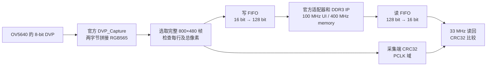

# ACG720 与 TY-OV5640 的 DDR3 帧缓存排查及实现

日期为 2026-10-08。开发板是小梅哥 ACG720，工程实际器件为 GW5AT-60B、GW5AT-LV60PG484AC1/I0，摄像头是用户提供的 TY-OV5640。

本次已经在实板打通 **OV5640 → 写 FIFO → DDR3 → 读 FIFO**。静态测试、摄像头内部彩条、摄像头实景三种输入均完成 800×480 整帧验证，用户分别确认 D0～D5 亮、D6 灭、D7 闪。

当前板上运行实景单帧自检版 `0xAF89`。它把一帧存入 DDR 后读回计算 CRC，完成后冻结，不是连续 HDMI 显示程序。仅写 FPGA SRAM，**断电不会保留这次下载的程序**。外部配置 Flash 未改写，HDMI 图像、持续视频、双缓冲及完整时序签核仍未完成。

## 1. 原问题如何判断

此前独立固定模式 BIST 通过了 256 字节读写，原主工程也曾通过 PLL、DDR 校准和摄像头初始化，但新增摄像头 DDR 诊断在 F15、B21 两个复位约束下都仅亮 D0。

旧诊断 D0 表示 DDR PLL 锁定，D1 表示 DDR 校准完成。只有 D0 亮意味着流程还停在校准阶段，并没有完成一次摄像头像素的有效写入和读回比较。因此，当时不能从“诊断没通过”推导出“DDR 芯片损坏”或“读回像素已经发生错误”。

用户随后要求按官方帧缓存向上接摄像头。本次采用第 38 章“串口传图 DDR3 缓存 TFT 屏和 HDMI 显示”的 800×480 帧缓存与时钟为基线，先用其确定数据源证明缓存路径，再逐步接入第 47 章的 OV5640 采集模块。

## 2. 旧诊断中确认了哪些问题

### 2.1 DDR PLL 的 mDRP 控制连接有缺陷

旧顶层把 DDR PLL 的 `pll_init_bypass` 固定为 0。这样外部 `pll_mDRP_intf` 无法接管 PLL 的 mDRP 控制，综合网表中相应逻辑被优化删除。原厂后续 [25K/60K DDR 更新说明](https://fpga.cn/forum.php?mod=viewthread&tid=29815) 要求在锁定延迟后交出控制权。

新基线使用 16 拍锁定延迟，在原始 50 MHz 域控制交接。

```verilog
reg [15:0] pll_lock_reg = 0;
wire pll_mdrp_ready = pll_lock_reg[15];

always @(posedge clk50m or negedge reset_n)
    if (!reset_n) pll_lock_reg <= 0;
    else pll_lock_reg <= {pll_lock_reg[14:0], pll_lock};

// DDR PLL
.pll_init_bypass(pll_mdrp_ready)

// pll_mDRP_intf
.pll_lock(pll_mdrp_ready)
```

`pll_stop` 的变化在原始 50 MHz 域登记，锁定交接完成后才允许触发 mDRP 请求。新静态及摄像头版的综合网表均确认适配器保留。

这是一处确定的源码连接缺陷，但本次没有只修改这一处的旧诊断实板 A/B 对照。新基线同时改变了时钟拓扑与测试流程，不能宣称旧版校准失败的唯一触发原因已经证实。

### 2.2 旧 FIFO 诊断的写入量达不到启动门槛

旧诊断只采集并回放 16 个 RGB565 像素，共 32 字节。写 FIFO 的读侧宽度是 128 bit，这些输入仅形成 2 个读侧数据块。

但它设置 `wr_bust_len=8`，官方适配器只有在 `wfifo_rcount >= wr_bust_len_a` 时才进入 WRITE。也就是需要至少 8 个块、64 个像素；旧诊断送完 16 个像素后，数据仍不足以启动这批 DDR 写入。

这里的 `wr_bust_len` 是适配器一次调度多少个 128-bit 用户块，不能混同为输入像素个数。DDR 的物理 BL8 与这个批次数也不是同一参数。

### 2.3 旧诊断没有等待实际写完成，且比较错位

旧状态机在固定延时后进入读阶段，没有以实际 DDR 写命令完成作为依据；官方适配器又允许独立读取，因此可能拿到本次测试尚未写入的内容。

读 FIFO 的配置是 `FWFT=true`、`OUTPUT_REG=false`。非空时，Q 已经是队首像素，pop 当拍应比较该值。旧代码使用延迟一拍的 `rd_fire_d`，却没有同步锁存 pop 当拍 Q；连续读取时，下一拍 Q 已变为后一个像素，比较会错位。

旧捕获事件还是一次性的 toggle，如果在等待校准时到达，后续等待捕获状态可能错过该事件。代码存在此失败路径，但没有证据表明当时事件确实提前发生。

上述数据量、读写顺序、比较与捕获问题发生在校准之后，不能用来解释旧版 D1 灭。详细证据见 [旧诊断缺陷记录](LEGACY-DDR-DIAGNOSIS-2026-10-08.md)。旧源文件保留，没有覆盖改写。

## 3. 第 38 章本轮综合失败如何解决

原第 38 章生成的 `rd_data_fifo.v`、`wr_data_fifo.v` 在本机 Gowin 1.9.12 / GW5AT-60B 下分别独立综合，都报 `RP0007`，提示当前器件没有 SSRAM 资源。DDR IP 和 PLL 独立综合通过，排查由此收敛到两个生成的 FIFO 实现。

本次采用资料包第 47 章中可以综合的官方 FIFO 实现。替换前逐字节核对两套 `.ipc`、`fifo_parameter.v`、`fifo_define.v`，确认配置完全相同。

| 配置 | 写 FIFO | 读 FIFO |
| --- | --- | --- |
| 输入宽度 | 16 bit | 128 bit |
| 输出宽度 | 128 bit | 16 bit |
| 深度 | 4096 个 16-bit / 512 个 128-bit | 512 个 128-bit / 4096 个 16-bit |
| 容量 | 8 KiB | 8 KiB |
| 实现 | EBR | EBR |
| FWFT / OUTPUT_REG | true / false | true / false |

替换后，独立综合和整工程综合、布局布线均通过。配置与哈希保存在静态工作副本的 `fifo-compatibility.json`，独立综合结果保存在 `.local/framebuffer-first/ip-audit/`。

这一问题解释的是本轮第 38 章的编译失败，不能作为旧已下载诊断校准失败的证据。原厂参考副本 `official-ch38` 的 278 个非 impl 文件保持逐字节一致。

## 4. 新链路具体怎样实现

### 4.1 时钟分别承担什么工作

| 时钟 | 来源 | 负责的逻辑 |
| --- | --- | --- |
| 原始 50 MHz | 开发板晶振，Y18 | SCCB、摄像头复位时序、DDR PLL 参考与 mDRP、心跳 |
| 系统 PLL 50 MHz | 第 38 章 Gowin_PLL | DDR IP 的参考 clk |
| 400 MHz | 独立 DDR PLL | DDR memory clock |
| 100 MHz | DDR IP 的 clk_out | DDR 用户接口、官方适配器、命令计数与地址检查 |
| 摄像头 PCLK | TY-OV5640，B18 | 官方 DVP 采集、完整帧检查、写 FIFO 输入、采集 CRC |
| 33 MHz | 系统 PLL 165 MHz 经 CLKDIV /5 | 读 FIFO 消费、读回 CRC |

DDR PLL 的 clkin/mdclk 来自原始板载 50 MHz，摄像头 PCLK 不参与 DDR 参考时钟。相对旧 camera_pll 拓扑，这使摄像头像素采集的变化与 DDR 参考分开。没有改变摄像头的实物接线。



DDR 型号按资料与 IP 配置为 MT41K128M16JT-125:K，x16、256 MiB，1:4 用户时钟比、128-bit 用户接口、物理 BL8。当前仅验证一帧窗口，没有测试整片容量。

### 4.2 摄像头怎样配置

DDR 校准完成后，摄像头 RST 保持低约 1 ms，释放后等约 20 ms，再用 100 kHz 开漏 SCCB 配置。沿用此前读取 ID 成功的 253 项官方 RGB 表，保留原 PLL、裁剪、HTS/VTS、缩放和 DVP 参数。

| 寄存器 | 配置及读回期望 |
| --- | --- |
| 0x300A / 0x300B | 芯片 ID 0x56 / 0x40 |
| 0x3808 / 0x3809 | 输出宽度 0x03 / 0x20，即 800 |
| 0x380A / 0x380B | 输出高度 0x01 / 0xE0，即 480 |
| 0x4300 | 0x61，沿用官方 RGB565 顺序 |
| 0x501F | 0x01，RGB 输出 |
| 0x503D | 彩条版 0x80；实景版 0x00 |

所有 ID 和 7 个配置寄存器读回一致才置 init_done、点亮 D3。不能仅凭发送了寄存器写事务就判定配置正确。

模块振荡器频率尚未测得，不沿用旧注释“25 MHz”作为事实，也不根据表中注释承诺帧率。用户确认模块排针支持 3.3 V；本次未改变银行供电。PWDN 未引出到 FPGA，沿用现有模块接法，不新增 FPGA XCLK。

RGB 表原来的常量-only `always @*` 在 Icarus 中产生空敏感项、不执行赋值。本地摄像头副本改为显式 addr 敏感项，使仿真初始化同一份常量表，避免未知值被条件判断误当作通过；原参考表未改。

### 4.3 如何保证捕获的是一帧

官方 DVP_Capture 在配置完成后释放复位，舍弃前 10 帧，并按 HREF 把高、低两个字节拼成 16-bit 像素。

新增 `camera_frame_gate.v` 等待帧间空白及下一次完整帧开始。它逐行要求恰好 800 个有效像素，帧结束时要求恰好 480 行、384000 个像素，并检查最后一行已结束。短行、长行、额外像素或异常边界置错误，不能启动成功读回比较。

只向写 FIFO 送这一帧。FIFO 满时记录溢出，不用丢失后的像素填补位置并假装整帧成功。所有完成/错误标志持续保持到复位，避免只发一个异步脉冲而被其他时钟域错过。

### 4.4 如何等待 DDR 写完再读

一帧的数据量和命令数量为

```text
800 × 480 = 384000 个 RGB565 像素
384000 × 2 = 768000 字节
768000 / 16 = 48000 个 128-bit 用户数据块
```

官方适配器使用地址单位为 16-bit 字，单个 BL8 用户块地址递增 8。监视器要求读、写接受的地址分别为 0、8、16……383992，各恰好 48000 个命令。这里的地址上限 384000 不能当作字节数。

800×480 基线沿用第 38 章的 200-block 调度批次，完整帧恰好是 240 批。读调度只有在实际接受全部写命令，且采集完整帧检查通过后才打开；读完规定的命令数后关闭，避免自动循环读混入其他内容。

监视器同时检查无请求响应、响应超量和超时。静态测试在 pop 当拍逐像素比较；摄像头测试在同一采样时刻更新 CRC。

### 4.5 CRC 和跨时钟数据怎样处理

采集 CRC 只对实际接受进入写 FIFO 的像素计算。读回 CRC 只对读 FIFO 非空且实际 pop 的像素计算。两端均按高字节、低字节次序使用 CRC32，反射多项式为 0xEDB88320，初值与最终异或均为 0xFFFFFFFF。

最后一个输入像素处理后，采集 CRC 冻结。帧结束后才置完整帧通过标志，再经两级同步进入 UI 和读时钟域，建立稳定多位数据的完成握手。读回恰好 384000 个像素后，将两端 CRC 比较；还必须没有帧尺寸、FIFO、命令、响应或超时错误，D5 才亮。

CRC 一致证明本次采集数据经过缓存后得到一致的校验值，并非逐像素独立比对；CRC 存在碰撞可能，也不能证明画面颜色和 HDMI 显示正确。静态版另有实际逐像素比较通过的证据。

## 5. 仿真与实板证据

### 仿真覆盖

- 静态控制器覆盖空读暂停、字节/行回绕、末像素损坏、输入溢出、错误写地址、提前读、无请求响应、超时及复位，并单独跑完 384000 像素。
- 使用实际官方数据源及 8→16 拼接模块，确认静态图案期望序列，避免只测自造数据源。
- 摄像头测试使用实际官方 DVP_Capture，覆盖异步 PCLK/UI/读时钟、FWFT 暂停、完整帧、短行、溢出和末像素损坏。
- 摄像头完整帧仿真 CRC 与独立 Python zlib 金值一致，测试序列的 CRC 为 0xCC8B28AB。这是仿真图案值，不是实景帧 CRC 的实际数值。
- 配置控制器使用实际 ROM 和事务级 SCCB 模型，确认 253 次写、2 次 ID 读、7 次配置读；错彩条或尺寸读回均拒绝 init_done。该模型不替代 SCCB 电气时序验证。

### 实板结果

| 阶段 | User Code | 比较方式 | 用户实际反馈 |
| --- | --- | --- | --- |
| 第 38 章静态图案 | 0x41A4 | 完整帧逐像素一致 | D0～D5 亮、D6 灭、D7 闪 |
| OV5640 内部彩条 | 0x4FCF | 帧尺寸正确，完整帧 CRC 一致 | D0～D5 亮、D6 灭、D7 闪 |
| OV5640 实景 | 0xAF89 | 彩条关闭读回确认，完整帧 CRC 一致 | D0～D5 亮、D6 灭、D7 闪 |

实景版相对彩条版只有两项源码变化，即表中 0x503D 改为 0x00、该寄存器读回期望改为 0x00，其余 src 文件逐字节一致。通过结果来自用户观察对应位流的 LED；下载工具没有自动测得 LED、实景 CRC 数值或 HDMI 图像。

三次 SRAM 下载均完成 100%，Status 为 0x70026020。下载身份与成功状态证明程序写入完成；DDR 和摄像头运行结果仍以对应 LED 测试判据为证据。无需外接逻辑分析仪，也没有进行外部探头接线。

## 6. 当前位流、文件和复现步骤

| 文件 | 用途 |
| --- | --- |
| `rtl/framebuffer_frame_test.v` | 静态完整帧逐像素测试 |
| `rtl/camera_frame_gate.v` | 摄像头完整帧选择和尺寸检查 |
| `rtl/framebuffer_camera_test.v` | 摄像头输入 CRC、DDR 命令计数、读 FIFO CRC |
| `tests/framebuffer_camera_test_tb.v` | 实际 DVP 模块、完整帧及故障注入仿真 |
| `tests/ov5640_readback_ctrl_tb.v` | 配置表和关键寄存器读回仿真 |
| `.local/framebuffer-first/ch38-camera-live/` | 当前实景工程、修改后的本地摄像头控制器和官方 IP |
| `.local/framebuffer-first/ch38-camera-live/build-audit-20261008.json` | 实景源码差异、位流哈希、时序端点记录 |
| `.local/logs/ch38-camera-live-*.log` | 实景编译、下载、配置控制器仿真日志 |

原厂工程、加密 IP 和位流保留在本机忽略目录 `.local`；纳入版本管理的是新增 RTL、测试、构建入口和说明，单独取出这些文件不能代替本地依赖。

在项目的 `code/fpga/acg720-ddr3` 目录运行官方工具编译

```powershell
& 'C:/Gowin/Gowin_V1.9.12_x64/IDE/bin/gw_sh.exe' 'build_ch38_camera_live.tcl'
```

恢复当前通过的实景自检位流前，先重新扫描下载器。location 8740 是本次记录，换 USB 端口后须使用扫描结果，不照搬旧值。

```powershell
$programmer = 'C:/Gowin/Gowin_V1.9.12_x64/Programmer/bin/programmer_cli.exe'
& $programmer --scan-cables F
# 确认当前 cable-index 和 location，再执行 SRAM 下载。
$frameFs = (Resolve-Path '.local/framebuffer-first/ch38-camera-live/impl/pnr/ch38_camera_live.fs').Path
& $programmer --device GW5AT-60B --operation_index 2 --fsFile $frameFs --cable-index 1 --location 8740 --frequency 15MHz
```

复现本次仿真依赖本机已安装的 `.local/tools/iverilog/bin/iverilog.exe` 与 `vvp.exe`，例如完整摄像头帧测试

```powershell
& '.local/tools/iverilog/bin/iverilog.exe' -g2012 -s framebuffer_camera_test_tb `
  '-Pframebuffer_camera_test_tb.FRAME_HEIGHT=480' `
  '-Pframebuffer_camera_test_tb.FULL_PASS_ONLY=1' `
  -o '.local/framebuffer-first/camera-full-test.vvp' `
  'rtl/framebuffer_camera_test.v' 'rtl/camera_frame_gate.v' `
  '.local/framebuffer-first/ch38-camera-bars/src/DVP_Capture.v' `
  'tests/framebuffer_camera_test_tb.v'
if ($LASTEXITCODE -eq 0) {
  & '.local/tools/iverilog/bin/vvp.exe' '.local/framebuffer-first/camera-full-test.vvp'
}
```

当前实景位流的 SHA256 为

```text
A718EFC364FEB9A6B47AD333686F0518D76A56DAD1955ABBA607262CAE790553
```

静态通过位流 SHA256 为 `DD7959D0C266BD507D50DE8FBCF6DE9F9487E5F3B2076F643A168929D81A6222`，彩条通过位流为 `5C13FEA6833E57650914D20B5983ED79A3BC3F629AAC3DCAD06833C74970BD92`。分别位于对应工作副本的 `impl/pnr/`，没有互相覆盖。

实景和彩条版的灯态定义相同

| 灯 | 含义 |
| --- | --- |
| D0 | 系统 PLL 锁定 |
| D1 | DDR PLL 锁定 |
| D2 | DDR 校准完成 |
| D3 | 摄像头 ID、尺寸、RGB565、彩条开关读回通过 |
| D4 | 整帧 DDR 写命令完成 |
| D5 | 整帧尺寸正确、读回 CRC 一致，且无其他错误 |
| D6 | 任一测试错误 |
| D7 | 心跳 |

S0 / F15 低有效复位，重新启动一次完整自检；旧主工程 B21 / S4 的按键定义不要套用到本版。

## 7. 断电保存、HDMI 与后续工作的边界

目前通过 `operation_index 2` 下载到 FPGA SRAM，配置在断电后丢失。重新上电会依开发板启动设置从配置 Flash 原有内容启动，本次没有核实该旧内容的图像表现，也没有将当前程序写入 Flash。

当前读 FIFO 消费者是 CRC 检验逻辑，检验完成后停止，摄像头输入也只保留一帧。虽然保留了官方 HDMI 输出相关模块，但这不等于视频数据已经按显示时序连续供给 HDMI。没有接显示器验证，不能承诺当前或断电后看到图像。

若后续要求连续显示并断电恢复，应先把读 FIFO 消费接回显示请求，建立帧边界与读写缓冲管理，再在显示器上检查图像、颜色、重复帧和撕裂。确认最终显示位流后，再将它写入配置 Flash并冷启动复测。不要把本次单帧 CRC 自检直接当作最终视频固件固化。

时序方面，当前实景版报告仍有 206 个 setup、56 个 hold 违反端点，涉及跨时钟、私有 PHY 和 HDMI 路径。已定义 50 MHz、33 MHz、100 MHz UI 及保守 100 MHz PCLK 约束，没有使用全局 false path 隐藏报告。PCLK 在 PNR 中使用 PRIMARY 时钟网络，BSRAM 35/118、SSRAM 0。实板单帧通过不能替代 CDC、复位和完整时序审核。

尚未验证 256 MiB 全容量、唯一地址覆盖、长时间稳定性及乒乓帧缓存。当前可以确认的工程成果是静态和彩条、实景的完整帧缓存链路均通过；旧校准失败的唯一触发原因仍缺单变量实板对照。

## 8. 资料与关联记录

原厂资料根目录为 `C:/Users/sc/Documents/Dev/Hardware/fpga/小梅哥ACG720国产高云FPGA教学开发板资料/`，主要参考 60K 第 37、38、47 章、ACG720 硬件原理图和引脚分配表。模块针脚依据用户提供的 TY-OV5640 照片和 `T-OV5640-PCB-V1.0-模型.pdf`，没有把 ACM5640 模块原理图当成 TY 模块的电路证明。

- [静态整帧验证与 FIFO 兼容性证据](FRAMEBUFFER-TEST-RESULT-2026-10-08.md)
- [摄像头彩条与实景下载、配置和灯态](CAMERA-FRAME-TEST-2026-10-08.md)
- [旧诊断缺陷及未确认根因](LEGACY-DDR-DIAGNOSIS-2026-10-08.md)
- [官方帧缓冲优先方案与硬件核对](FRAMEBUFFER-FIRST-PLAN-2026-10-08.md)
- [历史交接](DEBUG-HANDOFF-2026-10-06.md)

原始资料包、配置 Flash、已通过位流和无关 PCB 文件均未改写。许可证已解决，复现无需更改网卡地址或重新处理许可证绑定。
