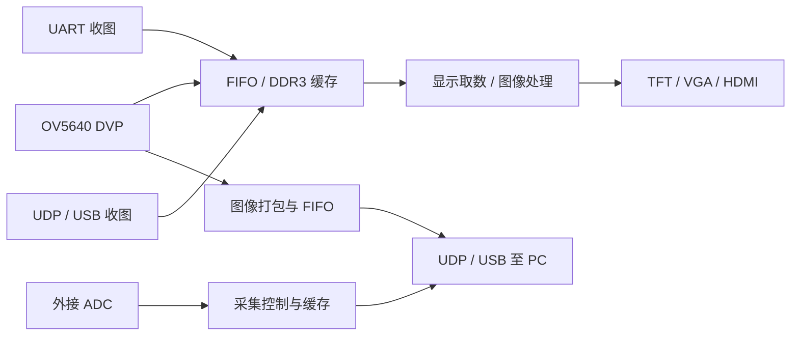

# ACG720 资料整理

整理日期：2026-09-09。统计基于生成本文件前的原始目录。

这是一套小梅哥／芯路恒 **ACG720 高云 Arora V FPGA 开发板教学与配套资源包**，同时提供 GW5AT138K、GW5AT60K 两种配置。主要设计语言是 Verilog，开发工具是 Gowin，教学仿真工具是 Modelsim。内容从数字逻辑基础一直延伸到 DDR3 帧缓存、图像处理、摄像头、千兆以太网和 USB2.0 数据采集。

当前目录以教程和独立示例为中心，没有顶层统一构建入口，也没有 `.git` 目录。`08_pro` 是为以后定制应用预留的占位目录。

**阅读范围说明：已完成全目录清点、PDF 全文提取、全部可读压缩包及嵌套包的目录遍历、Gowin 工程配置检查，并阅读教程结构、关键正文、主要模块接口与相关硬件资料。没有对 18.9 小时视频逐段听读，也没有对全部 18,614 页文档、所有 RTL 和工具库源码逐页逐行精读。详细范围见 [范围与方法](资料索引/范围与方法.md)。**

## 从哪里查资料

| 需求 | 整理后的入口 |
| --- | --- |
| 查某项实验对应哪章、哪套源码 | [70 章教程与工程导航](资料索引/章节与工程.md) |
| 查开发板接口、引脚及资料冲突 | [硬件与引脚核对](资料索引/硬件与引脚核对.md) |
| 查全部 PDF、页数和可搜索文本 | [PDF 文档目录](资料索引/PDF目录.md) |
| 查包内 `.gprj` 路径、器件、文件引用 | [工程清单](资料索引/工程清单.csv) |
| 按模块名查复用源码 | [源码模块索引](资料索引/源码模块索引.csv) |
| 查视频时长 | [视频清单](资料索引/视频清单.csv) |
| 查全部原始文件和压缩包内容 | [文件清单](资料索引/文件清单.csv)、[压缩包清单](资料索引/压缩包清单.csv)、[包内文件清单](资料索引/包内文件清单.csv) |

CSV 使用 UTF-8 BOM，可用 Excel、LibreOffice 或文本工具打开。路径中的 `::` 表示压缩包内部路径。

## 原目录总览

原始目录共有 **8,746 个文件，28,404,781,198 字节，约 26.45 GiB**。下面的计数包含工具自带文件、工程输出和版本管理残留，不等同于独立教学资料数量。

| 目录 | 文件数 | 主要内容与用途 |
| --- | ---: | --- |
| `01_doc` | 70 | 第 1～70 章 PDF，共 1,340 页；主学习路线 |
| `02_code` | 196 | 138K、60K 两套章节目录；147 个 ZIP/RAR，另有少量展开源码和 SVN 残留 |
| `03_videos` | 1,066 | 53 个 MP4，共 18:51:59；19 个展开的教学工程及编译、仿真输出 |
| `04_IOmessage` | 1 | 引脚分配 XLSX；Sheet1 有内容，Sheet2/3 为空 |
| `05_sofeware` | 7,322 | Gowin Linux IDE、两处 Programmer、Modelsim Windows 安装包、驱动、上位机工具和厂家文档 |
| `06_hradware` | 12 | 主板 15 页原理图、10 份外接模块原理图、机械文件下载链接 |
| `07-component-datasheets` | 31 | 29 份器件／协议 PDF、DDR3 仿真模型 ZIP、红外键码图片 |
| `08_pro` | 1 | 说明文件；当前没有定制应用工程 |
| `09-bundle-module-resources` | 46 | OV5640 摄像头、TFT 电容屏的手册、原理图、配置和其他板卡示例 |

根目录的 `resources-updated-periodically.txt` 只有空白字符，没有实际更新记录。

原目录共有 **339 份 PDF、16,850 页**。其中软件包内占 205 份、12,595 页，包含中、英、日多语言版本及两处 Programmer 的重复／不同版本文档。压缩包内另发现 14 份未与原目录 PDF 重复的文档，共 1,764 页，主要是 FX2、Keil C51、SDCC 和其他板卡 UVC 参考资料。

## 硬件平台

以下根据提供的主板原理图、引脚表和示例配置整理；实际焊接型号仍应以手头板卡为准。

| 功能 | 资料中的器件／接口 | 对应章节 |
| --- | --- | --- |
| FPGA | GW5AT-LV138PG484AC1/I0 或 GW5AT-LV60PG484AC1/I0；多数工程选择 B 版器件 | 2 |
| 系统时钟 | 50 MHz 有源时钟，FPGA 引脚 Y18 | 2、5、17 |
| 存储 | MT41K128M16JT-125:K，16 位、2 Gbit，即 256 MiB；原理图采用 1.5 V DDR 供电 | 36～43、45～47、61～63、67 |
| 配置 Flash | 原理图标 MX25L12845G，128 Mbit，即 16 MiB | 2 的程序固化 |
| 基础交互 | 8 个用户 LED、8 位拨码、5 个用户按键、8 位数码管、蜂鸣器、红外 | 5、11～13、19～22 |
| USB 串口 | CH340E；FPGA UART RX=J21，TX=M15 | 6～10、33～34、38 |
| I2C | 24LC64 EEPROM；RTC 原理图标 BM8563T，教程讲 PCF8563；ES8388 也使用板载 I2C 总线 | 32～35 |
| 板载 ADC | ADC128S102，8 通道、12 位，SPI 类串行接口 | 24～25 |
| 板载 DAC | TLV5618A，2 通道、12 位，SPI 类串行接口 | 23 |
| 音频 | ES8388 编解码器，I2C 配置、I2S 数据 | 35 |
| 视频显示 | 两路 HDMI 连接器、TFT FPC 接口；教程以 DVI/TMDS 视频发送为主 | 26～31、38～47 |
| 摄像头 | OV5640 外接模块，8 位 DVP 数据、SCCB 配置 | 44～47、59～60、70 |
| 以太网 | RTL8211F-CG，千兆 RGMII、MDIO 管理 | 48～63 |
| USB2.0 数据口 | CY7C68013A-56LFC（FX2LP），16 位 SlaveFIFO；与 CH340 串口是两个功能 | 64～70 |
| 扩展 | GPIO0 36 根信号、MicroSD、外接 ADC/DAC、VGA 模块等 | 18、21、26、62～63 等 |

GPIO 的 VCCIO 可配置为 3.3/2.5/1.8/1.5 V。默认实验所用电平和 DDR 电平不能混用。MicroSD、触控等接口虽有硬件资料，70 章主教程没有为它们都提供独立完整实验。

## 教程的知识结构

| 阶段 | 章节 | 学到的能力 |
| --- | --- | --- |
| 工具与验证 | 1～5 | 建工程、综合、管脚与时钟约束、仿真、GAO、下载 |
| 基础模块 | 6～13 | UART、协议帧、状态机、按键、模块复用、数码管 |
| FPGA 资源与外设 | 14～25 | ROM/RAM/FIFO/PLL、DDS/PWM、红外、串行 ADC/DAC |
| 显示与控制总线 | 26～35 | VGA/TFT/TMDS、图片与字模、I2C、EEPROM、RTC、音频 |
| 存储和图像流水线 | 36～43 | DDR3、帧缓存、灰度、中值／均值／高斯滤波、Sobel |
| 摄像头采集 | 44～47 | OV5640 初始化、DVP 接收、缓存和显示 |
| 网络数据系统 | 48～63 | RGMII、ARP、CRC、IPv4、UDP、MDIO、图像与 ADC 数据传输 |
| USB 数据系统 | 64～70 | FX2 固件、SlaveFIFO、双向流、JPEG 与摄像头传输 |

这套资料有两条主要应用路线：图像采集／缓存／处理／显示，以及 ADC 采集／缓存／传输到 PC。它们大量复用 FIFO、PLL、I2C、DDR3 和传输控制模块。



图中表达不同实验的组合关系；并非所有功能都在同一个工程中同时存在。

## 代码怎样使用

`02_code` 两套目录均覆盖第 1～70 章；第 1、27、49、50 章的说明文件明确写着“本章无例程”。第 44 章提供摄像头初始化与 DVP 模块，没有 `.gprj`；第 64 章主要提供 FX2 开发环境。138K 第 33 章的工程在 `A.rar`、`B.rar` 两个内层包中。

识别到 **167 份 Gowin `.gprj`**：章节压缩包及嵌套包中 148 份，视频展开工程中 19 份。检查了每份工程的器件、料号、启用文件和文件引用。没有发现启用文件缺失；发现 9 条缺失的禁用引用。这个结果只说明资源引用检查通过，不等于综合、仿真、时序或上板验证通过。

典型结构如下，实际路径以 `.gprj` 中的文件列表为准：

```text
example/
  *.gprj             Gowin 工程入口和器件选择
  src/               RTL、CST、部分 SDC、IP 生成文件
  sim/ 或 modelsim/  testbench、*.mpf、*.do、波形设置
  impl/              综合、布局布线、报表及 *.fs 等输出
```

同名模块在不同实验中可能有不同接口或参数，不宜直接把所有 `src` 文件放入同一工程。例如 `Gowin_PLL`、`disp_driver`、`uart_byte_rx`、`ddr3_ctrl_2port` 都有多个版本。源码模块索引保留路径和内容哈希，便于区分副本。

| 复用模块／组件 | 作用 | 查找起点 |
| --- | --- | --- |
| `uart_byte_tx`、`uart_byte_rx` | 串行字节收发 | 6～9；视频 12～13 |
| `key_filter`、`hex8`、`hc595_driver` | 人机接口 | 11～13 |
| `i2c_bit_shift`、`i2c_control` | I2C 位时序与事务控制 | 32～35、44～45 |
| `disp_driver`、`disp_parameter_cfg` | 显示时序与分辨率参数 | 26～31 |
| `dvi_encoder`、`encode`、串行发送模块 | TMDS 编码和输出 | 29、47 |
| `ddr3_ctrl_2port`、`fifo_ddr3_adapter` | 16 位流接口与 DDR3 的 128 位用户端口适配 | 37 |
| `camera_init`、`DVP_Capture` | 摄像头配置、两字节像素拼接与帧同步 | 44～45 |
| `gmii_to_rgmii`、`rgmii_to_gmii` | 千兆接口 DDR 收发 | 51 |
| `crc32_d8`、`ip_checksum`、`eth_udp_*` | 网络帧校验和 UDP 数据通路 | 52～58 |
| `mdio_bit_shift`、`phy_reg_config` | PHY 配置 | 57 |
| `usb_stream_in`、`usb_stream_out` | FX2 SlaveFIFO 数据传输 | 65～70 |

建议把所选实验解压到短的英文路径，例如 `work/led_flash_60k/`，再打开对应 `.gprj`。先确认器件和完整料号，核对顶层、复位键、CST、IP 文件与仿真库，再编译。资料中的 Modelsim 工程可能保留原作者电脑的库路径，需要重新映射。

## 当前软件包与开发流程

本地已有 Gowin Linux IDE：`05_sofeware/Gowin_V1.9.12.03_linux/IDE/`。它的发布说明 RN100-1.9.12.03 日期为 2026-06-17。教程和较早的 CST 文件常见 1.9.9.01、1.9.10.03、1.9.11 标记；这些是资料历史版本，不能据此假定新版本工具已对全部示例验证过。

Programmer 有两份：IDE 套件中的 `Programmer/`，以及 `programmer1.9.12.03(2712).Linux.x86/Programmer/`。后者附带的部分手册和发布说明比 IDE 套件内的旧，不能只看外层目录名称判断内容相同。

Modelsim 提供的是 **SE 10.6d Windows 安装程序**。配套说明推荐 10.6d，这是课程的历史环境建议；没有在本机确认它的可用性。NetAssist、USB_Display、串口助手、UDP Camera 等上位机主要也是 Windows `.exe`，因此“Gowin 有 Linux 版本”并不意味着所有课程上位机在 Linux 上开箱即用。

本次整理没有启动 IDE、修改驱动、配置许可证、重建示例或下载 FPGA。

| 查询内容 | 软件包内优先查的手册 |
| --- | --- |
| 工具操作／安装 | SUG100、SUG501、SUG918 |
| Arora V 物理约束 | SUG1018 |
| 时序约束 | SUG940 |
| Tcl 自动化 | SUG1220 |
| GAO／虚拟 IO | SUG114、SUG1189 |
| Arora V 存储器／GPIO／DSP／时钟 | UG300、UG304、UG305、UG306 |
| 下载工具 | SUG502 |
| 138K／60K 编程配置 | UG704／UG718 |

准确版本、路径和可检索文本见 [PDF 目录](资料索引/PDF目录.md)。

## 已确认的差异与使用注意点

1. **60K 目录不保证每份工程都选择了 60K。** 第 31 章 `rom_char_tft800x480_224x64/rom_char_tft_hdmi/rom_char_tft_hdmi.gprj` 仍选择 GW5AT-138B。同章另一个分支选择 60K。
2. **第 36 章是官方 DDR3 参考设计。** 138K 名称的包实际选择 GW5AST-LV138FPG676AES；25K 包选择 GW5A-LV25UG324C1/I0，均不是本板 PG484A 配置。教程明确要求 60K 参照 25K 的 mDRP 停钟方式；后续板级实验应优先对照第 37 章及所选板型的工程。
3. **引脚表存在错误和省略。** N19 被同时列为 LED8、BEEP；原理图只有 LED0～7 用户灯，N19 对应蜂鸣器。摄像头数据／同步输入、USB 双向数据和以太网发送时钟的方向也需按 RTL／原理图核对。
4. **TFT 总线位序因工程而异。** 第 28 章把红色放在 `TFT_rgb[15:11]`；第 38／45 等章把红色放在 `[4:0]`，并配套不同 CST。不能只复制端口名或引脚表。
5. **器件手册并非完整对应当前原理图 BOM。** PHY 原理图是 RTL8211F，配套主要是 E/EG 手册；Flash 原理图是 MX25L12845G，配套是 N25Q128；RTC 原理图是 BM8563T，教程和手册讲 PCF8563。寄存器和烧录命令应核对准确型号。
6. **默认复位键不完全统一。** 引脚表把 S4/B21 标为复位，但第 29、65 等示例使用 S0/F15。以当前工程 CST 为准。
7. **网络图像例程有超标准 MTU 的载荷。** 第 59 章默认每行 `1280×2+2=2562` 字节作为 UDP 数据；网络路径需支持相应巨型帧，或修改 FPGA 分包策略。示例常用 FPGA `192.168.0.2:5000`、PC `192.168.0.3:6102`，仍应逐工程确认。
8. **第 70 章 USB 带宽说明有事实错误。** 文中把 USB2.0 说成 8b/10b 编码；FX2 技术参考手册说明使用 NRZI 和位填充。480 Mbit/s 的原始速率不能直接用“乘 80%”推导有效载荷。该章源码默认 800×480，正文另有 1280×720 的描述。
9. **FX2 短包要处理提交。** 第 65 章回环示例没有使用 PKTEND 处理不足自动提交长度的包；小包可能读回超时。JPEG 文件本身也不保证总是 512 字节整数倍，不能将示例测试条件当作格式规则。
10. **摄像头 V5 文档有版本冲突。** V5 用户手册仍写支持补光／自动对焦，目录内说明文件却明确写 V5 没有相应硬件支持。该能力需要根据模块实物确认；其他 AC620／AC6102 示例不能直接当 ACG720 工程使用。
11. **摄像头 PWDN 的示例约束与原理图冲突。** 第 45 章将 `camera_pwdn` 约束到 L1 并固定输出 0；主板第 2 页中 L1 是 `HDMI2_SCL`，第 11 页摄像头 PWDN 由 R136 下拉，并未画出至 FPGA 的连接。移植摄像头或组合 HDMI2 功能时应核对这一处，不能照抄成板级引脚定义。

工程统计中只有 7 份 `.gprj` 显式启用了 SDC 文件。这不等于其余工程没有任何自动或 IP 内部时序约束，也不证明时序已经收敛。进入实际开发时，需要检查具体设计的时钟定义、跨时钟域、输入输出延迟及布局布线时序报告。

## 建议的学习和开发顺序

先完成第 2～5 章的 LED、仿真和 GAO，确认工具、下载线、时钟与复位工作；随后做第 6～13 章 UART 和按键数码管，再掌握第 14～17 章 IP。

做图像项目时，可按 **28/29 彩条 → 36/37 DDR3 → 38 串口传图 → 44/45 摄像头 → 47 HDMI → 39～43 图像处理** 的顺序验证。这样每一步都有可观察结果。

做数据采集时，可按 **24/25 板载 ADC → 48/51/57/58 网络基础与回环 → 62/63 外接 ADC 采集**；需要 USB 时先完成 **64 环境和固件 → 65 回环 → 66/68 单向流 → 67/69/70 应用**。

## 资源链接与当前缺口

原资料给出的在线视频地址是 <https://www.bilibili.com/video/BV1VMCFBFE76>。工具更新链接和机械文件链接分别记录在 `05_sofeware/utilities/geng-duo-ruan-jian-xia-zai-di-zhi.txt`、`06_hradware/mechanical-dimensions-wen-jian.txt`；本次没有验证外链是否仍可访问。

当前目录没有独立的 ACG720 主板机械图文件，只有下载链接；屏幕模块则提供了 JPG／PcbDoc 机械文件。没有找到与原理图一致的 RTL8211F、MX25L12845G 独立数据手册。现有资料可以支撑教学例程学习，但这些缺口应在使用相应器件的高级功能前补齐。
