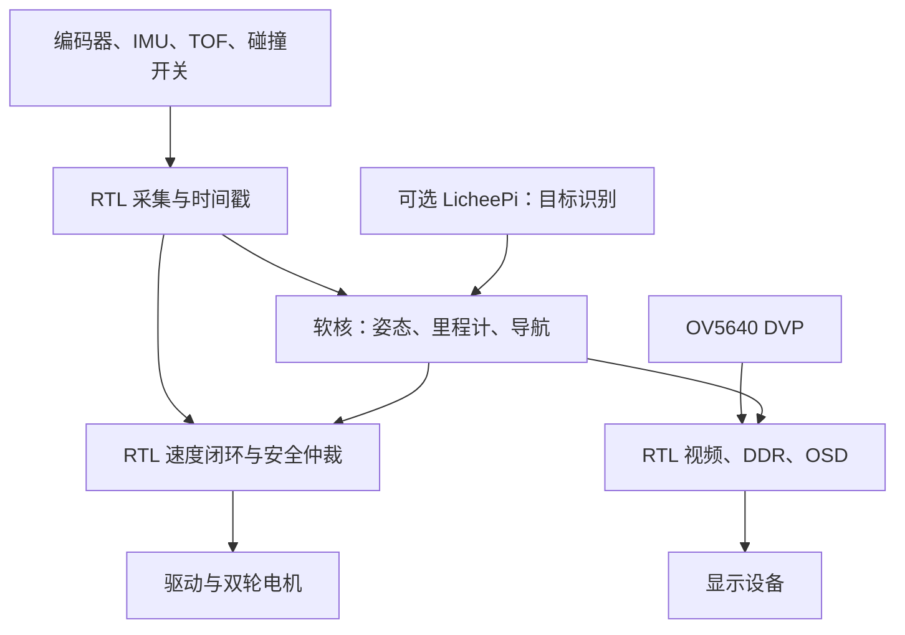

## 器件选型总表

| 部分 | 方案 | 数量 | 用途与落实事项 |
| --- | --- | ---: | --- |
| 机械底盘 | 现有两驱动轮＋两万向轮 | 1 套 | 双轮差速；检查车架平整度，实测轮径和轮距 |
| FPGA | 小梅哥 ACG720 | 1 块 | RTL 实时感知控制、软核导航、视频显示；核对实物版本及例程 |
| 电机 | WHEELTEC MG513XP28_12V | 2 台 | 12 V 有刷减速编码电机；分别标定计数和方向 |
| 电机驱动 | 优先评估 DRV8874 单路模块 | 2 块 | 替换正式底盘中的 TB6612；采购前确认电流、散热、限流与 3.3 V 接口 |
| FPGA 摄像头 | OV5640 DVP 模块 | 1 个 | 选择与 ACG720 接口、排线和电平匹配的模块 |
| IMU | ICM-42688-P 模块 | 1 个 | 优先 SPI；姿态、角速度和相对航向融合 |
| 近距离避障 | VL53L1X 模块 | 3 个 | 左前、正前、右前；独立 XSHUT、共用 I²C |
| 碰撞检测 | 微动开关＋前保险杠 | 2 个开关＋1 套保险杠 | 左右触发，直接参与硬件安全逻辑 |
| 显示设备 | 与板卡官方视频例程匹配的屏幕或显示器 | 1 套 | 显示画面、姿态、速度、距离和故障；接口确认后定型号 |
| 电源 | 电池＋分路稳压＋保险丝＋总开关＋急停 | 1 套 | 执行器与计算支路分开；满电电压、瞬态和回生需核对 |
| 调试工具 | USB 串口、万用表、限流电源、逻辑分析仪 | 1 套，可借用 | 电气检查、波形、日志和响应时间测量 |
| AI 扩展 | LicheePi 4A | 可选 1 块 | TH1520 NPU 视觉推理；模型需适配，实测性能，不按 TOPS 推断帧率 |
| AI 摄像头 | Linux UVC USB 摄像头 | 可选 1 个 | 接 LicheePi；第一版与 FPGA 摄像头分开使用 |
| LiDAR | LD06 | 可选 1 个 | 后期增强感知；接入雷达不等于完成 SLAM |

### 现有电机参数

| 参数 | 数值或描述 |
| --- | --- |
| 厂商与型号 | WHEELTEC，MG513XP28_12V / MG513X；标识 F01070199 的含义待核对 |
| 类型 | 直流有刷减速电机，全金属减速齿轮 |
| 额定电压／减速比 | 12 V／1:28 |
| 减速后空载／额定转速 | 370 ± 12 rpm／300 ± 12 rpm |
| 额定／堵转电流 | 0.36 A／3.2 A，每台 |
| 额定扭矩 | 1 kgf·cm，约 0.098 N·m |
| 堵转扭矩 | 4.5 kgf·cm，约 0.441 N·m |
| 标称功率／重量 | 4 W／约 0.17 kg |
| 输出轴径 | 约 6 mm |
| 编码器 | AB 相霍尔，基础分辨率 13 PPR，含义需核对 |
| 编码器供电 | 3.3～5 V，输出电平需单独确认 |
| 四倍频输出轴计数 | 若 13 PPR 为电机轴每相周期数，则理论 1456 counts/rev，必须实测 |

## 一、路线：FPGA 做实时闭环，软核做导航，AI 最后接入

| 评分项目 | 占比 | 开发重点 |
| --- | ---: | --- |
| FPGA 实时感知与控制 | 40% | 图像、姿态、编码器、闭环控制、实时避障 |
| 系统稳定性 | 25% | 供电、超时保护、异常停车、长时间运行 |
| 自主导航能力 | 20% | 相对定位、路径点、绕障后恢复导航 |
| 创新设计 | 10% | 并行采集、独立安全逻辑、可测量的确定性控制 |
| AI 扩展功能 | 5% | 目标识别、跟随与搜索 |

实施顺序：

**底盘与供电 → 电机闭环 → IMU/TOF → 摄像头显示 → 路径点导航 → 稳定性测试 → AI 扩展**

---

## 二、硬件问题

### 2.1 电机电源与 FPGA 电源分支供电

建议接法：

| 电源支路 | 连接方式 |
| --- | --- |
| 总输入 | 电池 → 总保险丝与总开关 |
| 执行器 | 支路保险丝 → 急停切断装置 → 驱动 → 两台电机 |
| FPGA | 独立稳压模块 → ACG720 手册允许的输入 |
| AI | 独立 5 V 稳压模块 → LicheePi，容量按主板和 USB 外设峰值负载选择 |
| 传感器 | 对应电压的供电 → 摄像头、IMU、TOF，核查模块输入及 IO 电平 |

ACG720 输入为 6～12 V。普通三串锂电池满电为 12.6 V，在手册没有明确允许前，不直接接 FPGA 板输入。电机 12 V 额定值也不自动代表可以长期满占空比接满电电池，需核对许可范围。

注意：

- FPGA 稳压输出按板卡手册选定，例如在确认支持后选用 9 V；稳压器需覆盖整个电池放电范围。
- 电机回流不要经过 FPGA 或传感器地线。
- 各部分建立可靠公共参考地，优先星形布线。
- 驱动附近布置储能电容和去耦，电源方案要考虑电机回生。
- 急停使用适合直流负载的开关或切断装置，不让小按钮直接承受不匹配的大电流。
- **切断电机电源不等于立即刹住车**，断电滑行距离也要测试。
- 驱动使能引脚加硬件下拉，保证 FPGA 未配置、复位、下载程序时电机不动。

### 2.2 编码器分辨率必须实测

若“13 PPR”表示电机轴每相每转 13 个完整周期，减速比确为 28，那么四倍频后：

\[
N=13\times4\times28=1456\ \text{counts/输出轴转}
\]

**1456 只能作为待验证值。**

实际操作：

1. 电机断开驱动。
2. 给编码器正确供电。
3. 输出轴做好标记。
4. 手动转输出轴 10 圈。
5. 读取 FPGA 累计计数，除以 10。
6. 左右电机分别测量，并确认正转计数符号。

编码器电源为 3.3–5 V，不代表其输出一定可直接接 FPGA。需要核查输出形式、电平和上拉位置。


---

## 三、总体架构及职责分配



安全模块对最终驱动输出拥有禁止权限，普通速度斜坡不能延迟急停、碰撞或严重故障的响应。

### 分工原则

| 执行位置     | 负责功能                                                     | 不负责                         |
| ------------ | ------------------------------------------------------------ | ------------------------------ |
| FPGA RTL     | 编码器、PWM、轮速 PI、安全联锁、时间戳、视频流水线、通信外设 | 复杂传感器初始化和高层任务逻辑 |
| FPGA 软核 C  | IMU/ToF 驱动、姿态、里程计、导航和绕障                       | 直接绕过安全模块操作电机       |
| Lichee Linux | 可选识别、任务请求、日志或可视化                             | 安全停车、底层轮速闭环         |

软核优先使用**高云器件及工具版本匹配、已有可运行 BSP 的方案**。可优先评估 Gowin PicoRV32，但必须确认当前器件、工具和 BSP 的兼容性。先裸机定时任务，不必一开始移植 RTOS。软核位于 FPGA 内部，不需要额外增加 STM32。第一至第二周应跑通串口打印和外设寄存器访问。

建议软核代码、栈和实时数据优先使用片内存储，视频占用 DDR，避免显示带宽争用干扰控制；若必须共用 DDR，要测试最坏访问延迟。

---

## 四、FPGA 按这些模块拆分

### 4.1 时钟、总线及公共模块

| 模块文件         | 输入/输出                   | 实现内容与验收                           |
| ---------------- | --------------------------- | ---------------------------------------- |
| `clock_reset.v`  | 板载时钟 → 各时钟域/复位    | PLL 锁定后释放；各域复位同步释放         |
| `timebase.v`     | 时钟 → µs 时间戳、周期 tick | 用计数使能产生周期，不随意生成新逻辑时钟 |
| `gpio_sync.v`    | 外部单比特 → 同步信号       | 编码器、故障、开关信号同步               |
| `async_fifo.v`   | 跨域数据流                  | 使用成熟 FIFO IP，处理视频跨时钟         |
| `csr_bridge.v`   | 软核总线 ↔ 外设寄存器       | MMIO 读写、地址译码、状态快照            |
| `event_logger.v` | 故障事件 → FIFO             | 记录故障码和时间戳                       |

多位数据跨域不能简单“每位串两个触发器”，要使用 FIFO、握手或稳定快照机制。

### 4.2 电机控制模块

| 模块文件            | 数量 | 具体功能                              |
| ------------------- | ---: | ------------------------------------- |
| `encoder_ab.v`      |    2 | AB 四倍频解码、正反计数、非法跳变统计 |
| `speed_estimator.v` |    2 | 窗口计数测速，后续可加入周期测量      |
| `setpoint_ramp.v`   |    2 | 限制目标轮速变化率                    |
| `wheel_pi.v`        |    2 | 定点 PI、输出饱和、积分抗饱和         |
| `motor_pwm.v`       |    2 | 20 kHz PWM、占空比同步更新            |
| `motor_output.v`    |    2 | 驱动接口适配、方向切换保护            |
| `safety_manager.v`  |    1 | 最高优先级停机、超时、故障锁存        |

### 编码器处理

解码合法序列，例如：

```text
00 → 01 → 11 → 10 → 00：+1
00 → 10 → 11 → 01 → 00：-1
00 → 11、01 → 10：非法跳变，计错误，不猜方向
```

安装后若某一侧前进计数为负，在参数中反号即可。

滤波时间应短于最高转速时的有效脉冲宽度，不能用按键那种毫秒级去抖处理编码器。

### 轮速估计

\[
v_{L,R}=\frac{\Delta n_{L,R}}{N_{L,R}}\frac{\pi D_{L,R}}{T_s}
\]

其中：

- \(D\)：有效轮径；
- \(N\)：每输出轴转计数；
- \(T_s\)：计数窗口；
- \(\Delta n\)：窗口增量。

建议初版：

- 公共调度 tick：1 kHz；
- 轮速估计和 PI：100 Hz，即 10 ms 更新；
- PWM：20 kHz。

**没有必要为了“实时”把轮速 PI 强行做到 1 kHz。**

例如轮径假设为 65 mm、编码器为 1456 counts/rev，在 0.1 m/s 时，1 ms 内只有约 0.71 个计数；直接用 1 ms 差分会明显抖动。低速性能不够时，再增加 M/T 测速，并设置无脉冲超时归零。

### 双轮 PI

\[
e_k=v_k^\*-v_k
\]

\[
I_k=\operatorname{clamp}(I_{k-1}+K_iT_se_k)
\]

\[
u_k=\operatorname{clamp}(K_pe_k+I_k+u_{ff})
\]

初版先不用微分项：

1. 悬空确认方向、编码器符号和反馈极性。
2. 关闭积分，逐步加比例。
3. 落地低速测试。
4. 增加积分，消除持续误差。
5. 最后补前馈、静摩擦补偿和斜坡。

定点实现先定义统一单位，例如轮速用带小数的 mm/s，乘法使用加宽中间结果；缩位前饱和，禁止溢出回绕。

目标反向时，先减速至接近零，再切换方向。真正的紧急停机应绕过普通斜坡；刹车还是关断按驱动能力及测试结果配置。

### 4.3 安全模块：必须独立于导航软件

建议状态：

| 状态 | 含义与转换 |
| --- | --- |
| `DISARMED` | 未解锁，禁止运动；自检完成后可进入 READY |
| `READY` | 等待明确解锁和有效任务，满足条件后进入 RUN |
| `RUN` | 执行任务；停止后退出运行，故障时进入 FAULT |
| `FAULT` | 停止并锁存故障，清除后回到 DISARMED |

允许进入 `RUN` 的条件：

- 急停释放；
- 驱动无故障；
- 软核心跳有效；
- 当前控制命令未过期；
- 对当前动作必需的传感器有效；
- 用户显式解锁。

建议故障表：

| 事件               | 动作                                   |
| ------------------ | -------------------------------------- |
| 急停触发           | 硬件切断执行器支路，同时记录状态       |
| 碰撞触发           | 立即进入停止动作并锁存                 |
| 驱动过流/过温      | 禁止输出，锁存故障                     |
| 软核心跳超时       | 停机                                   |
| 当前控制源命令过期 | 停机或受控停止                         |
| 前向 ToF 失效      | 禁止继续依赖该感知前进，基础版直接停机 |
| 编码器异常         | 停止对应控制，禁止长期大占空比输出     |

碰撞输入可以“触发即锁存、释放再去抖”，不应为了等待几十毫秒稳定而推迟首次停止。

**解除故障不等于自动恢复运行**：清故障、重新解锁、重新下发任务应是三个明确动作。

---

## 五、传感器按“RTL 总线 + 软核驱动”实现

### 5.1 ICM-42688-P：优先 SPI

### RTL

`spi_master.v`：

- 支持所需 SPI 模式；
- 可配置分频；
- 多字节连续读写；
- TX/RX FIFO；
- 完成和超时状态；
- 数据就绪信号同步与时间戳。

### 软核

`icm42688.c`：

1. 读器件标识；
2. 复位并等待；
3. 配置量程、输出频率和滤波；
4. 静止采样，估计陀螺零偏；
5. 按数据就绪事件读取；
6. 转换单位并做安装坐标系变换；
7. 输出有效标志和采样时间。

建议起始设置：

- IMU 采样：约 200 Hz；
- 姿态融合：约 200 Hz；
- 屏幕姿态数值刷新：10–20 Hz。

具体寄存器值以器件手册和模块接法为准。

### 姿态算法

第一版用互补滤波即可：

\[
roll_k=\alpha(roll_{k-1}+\omega_x\Delta t)
 +(1-\alpha)roll_{acc}
\]

pitch 同理。大加减速时，加速度计不再只测重力，应降低其校正权重。

航向使用陀螺和轮式里程计融合：

\[
\Delta\theta_{enc}=\frac{\Delta s_R-\Delta s_L}{b}
\]

\[
\Delta\theta=
\beta(\omega_z-b_z)\Delta t+
(1-\beta)\Delta\theta_{enc}
\]

需要明确：

> ICM-42688-P 是六轴 IMU，无法给出长期无漂移的绝对航向；编码器与陀螺融合也不能消除所有航向漂移。

第一版展示的是相对初始姿态的 yaw，而不是绝对北向角。

### 5.2 三个 VL53L1X：独立 XSHUT，共用 I²C

建议安装：

- 中间：正前方；
- 左侧：左前方初始约 30°；
- 右侧：右前方初始约 30°。

最终角度由车体宽度和测试场地确定。三束测距并不覆盖完整车体轮廓，原地旋转时车角的扫掠区域尤其要注意。

### RTL

`i2c_master.v`：

- 开漏输出；
- START/STOP；
- ACK/NACK；
- 连续寄存器访问；
- 超时；
- 条件允许时的总线恢复。

`tof_guard.v`：

- 三路距离、状态、时间戳寄存器；
- 数据过期判定；
- 按速度档位检查保守距离阈值；
- 输出危险/失效标志给安全模块。

### 软核

`vl53l1x_port.c` 适配厂商驱动需要的 I²C 读写和延时接口，不建议手写整个传感器初始化 RTL。

三颗上电默认地址相同，通常采用：

```text
全部 XSHUT 拉低
    ↓
释放左探头 → 等待启动 → 改地址
    ↓
释放中探头 → 等待启动 → 改地址
    ↓
释放右探头 → 等待启动 → 改地址
    ↓
配置测量 → 周期读取
```

可在自己的 I²C 控制器中统一使用 7-bit 地址，例如 `0x30/0x31/0x32`；适配厂商 API 时明确其是否要求左移后的地址，避免默认地址 `0x29` 与 `0x52` 混淆。

同时核查模块的 I²C 上拉电压和 XSHUT 电平，不能把转接板与裸芯片的耐压混为一谈。

**调度建议：**

- 先逐个探头调通；
- 再接三颗；
- 测试同时测量是否存在光学干扰；
- 若采用错峰/串行测量，重新统计每个方向的真实刷新间隔。

导航循环跑 50 Hz，不代表 ToF 就提供 50 Hz 的新测量。

---

## 六、摄像头与显示链路：先通图，再叠加

### 6.1 模块拆分

| 模块                         | 功能                           |
| ---------------------------- | ------------------------------ |
| `ov5640_init.c` 或初始化 ROM | 摄像头 SCCB 配置               |
| `cam_xclk.v`                 | 按模块要求提供摄像头时钟       |
| `dvp_rx.v`                   | 在 PCLK 域采集 VSYNC/HREF/DATA |
| `pixel_unpack.v`             | 两字节组装 RGB565 像素         |
| `video_async_fifo.v`         | PCLK 域到 DDR 接口域           |
| `frame_writer.v`             | 按帧/行写入 DDR                |
| `frame_manager.v`            | 帧完成握手、读写缓冲所有权     |
| `frame_reader.v`             | 从 DDR 读取显示像素            |
| `display_timing.v`           | 按实际接口生成显示时序         |
| `osd_overlay.v`              | 字符、数值、状态框叠加         |

第一版建议从官方例程支持的低分辨率开始，例如 **640×480、RGB565、约 30 fps**。

其摄像头有效像素写入量约为：

\[
640\times480\times2\times30
=18.4\ \text{MB/s}
\]

双帧缓存约需 1.23 MB。显示若以 60 Hz 读取，读流量还要另算，并预留 DDR 效率和突发访问裕量。

帧缓存必须有读写所有权管理；写端不能覆盖显示正在读取的帧。不同帧率下允许丢帧或重复帧，不能靠无条件交换地址碰运气。

### 6.2 屏幕内容

建议显示：

```text
OV5640 实时画面

MODE: AUTO       WP: 2/4
ROLL:  +1.2°     PITCH: -0.8°
YAW:  +35.6°
VL: 0.18 m/s     VR: 0.20 m/s
TOF: 620 / 810 / 540 mm
FAULT: NONE
```

软核每 50–100 ms 更新一次 OSD 参数，RTL 负责逐像素叠加；姿态寄存器使用一致性快照，避免显示到更新一半的数据。

**实施次序：**

1. 显示彩条；
2. 摄像头数据计数正确；
3. 显示摄像头画面；
4. 加固定文字；
5. 加姿态数值；
6. 加速度、距离和故障状态。

不要把视频首次调通与整车闭环首次调通安排在同一个步骤里。

---

## 七、导航：先完成“已知起点、小场地、短路径”

### 7.1 第一版的工作边界

建议演示场景：

- 平整室内地面；
- 已知起点和初始朝向；
- 3–5 个预设路径点；
- 少量静态、规则、具有足够测距反射的障碍物；
- 保留足够宽的绕行空间；
- 初始速度限制在 0.15–0.25 m/s。

这版是**相对定位的路径点导航**，不是任意环境 SLAM。

### 7.2 里程计

\[
\Delta s_L=\frac{\Delta n_L}{N_L}\pi D_L,\quad
\Delta s_R=\frac{\Delta n_R}{N_R}\pi D_R
\]

\[
\Delta s=\frac{\Delta s_R+\Delta s_L}{2}
\]

结合前述融合航向增量：

\[
x_{k+1}=x_k+\Delta s\cos(\theta_k+\Delta\theta/2)
\]

\[
y_{k+1}=y_k+\Delta s\sin(\theta_k+\Delta\theta/2)
\]

\[
\theta_{k+1}=\operatorname{wrap}(\theta_k+\Delta\theta)
\]

轮径和轮距要标定：

- 多次直行已知距离，标定左右有效轮径；
- 多次低速定点转向，修正有效轮距；
- 正反方向重复，观察万向轮和打滑造成的不一致。

两只万向轮要安装平整、转动顺畅。车架不平会改变驱动轮受力，引起里程误差。

### 7.3 路径点控制

当前目标点 \((x_g,y_g)\)：

\[
\rho=\sqrt{(x_g-x)^2+(y_g-y)^2}
\]

\[
e_\theta=\operatorname{wrap}(\operatorname{atan2}(y_g-y,x_g-x)-\theta)
\]

第一版采用“先转向，再前进”：

- 角度误差大于约 25°：低速原地转向；
- 角度基本对准：边走边修正；
- 接近目标点：减速；
- 进入到达半径并满足稳定条件：切换下一个点。

控制请求：

\[
v=\operatorname{clamp}(k_\rho\rho,0,v_{max})
\]

\[
\omega=\operatorname{clamp}(k_\theta e_\theta,-\omega_{max},\omega_{max})
\]

差速变换：

\[
v_L^\*=v-\frac{b\omega}{2},\quad
v_R^\*=v+\frac{b\omega}{2}
\]

若任一轮超限，两轮按相同比例缩小，尽量保持请求曲率。

软核只向控制模块提交 \(v,\omega\) 或轮速目标，不直接写 PWM。

---

## 八、自主绕障不能只写“遇障停车”

建议实现一个有恢复条件、有超时的状态机：

正常流程为：路径点跟踪 → 减速 → 选择方向 → 转离障碍 → 绕行 → 恢复导航。任何状态出现碰撞、感知失效或超时，均进入安全停止。具体条件见下表。

### 各状态的动作

| 状态              | 动作                       | 退出条件                             |
| ----------------- | -------------------------- | ------------------------------------ |
| `FOLLOW_WAYPOINT` | 正常导航                   | 进入减速区                           |
| `DECELERATE`      | 受控减速                   | 接近停止或安全低速                   |
| `CHOOSE_SIDE`     | 比较左右有效距离和车体裕量 | 有可尝试方向，否则停机               |
| `TURN_AWAY`       | 小角度、低速转向           | 达到角度且前方可走                   |
| `PASS_OBSTACLE`   | 沿选定侧绕行               | 已行驶一定距离，障碍趋势支持通过判断 |
| `REJOIN_PATH`     | 重新朝原目标导航           | 恢复正常路线                         |
| `SAFE_STOP`       | 停止并报告原因             | 人工确认/重新规划                    |

实现时增加：

- 距离阈值迟滞；
- 连续有效样本确认；
- 单状态超时；
- 最大绕行距离；
- 最大尝试次数；
- “距目标长期不减小”的无进展检测。

三束 ToF 无法证明整个绕行空间无障碍。基础版只承诺在已定义的简单障碍场景内完成绕障；U 型障碍、窄缝和复杂动态障碍可能需要停机，而不是不断盲试。

### 安全距离必须随速度变化

建议使用：

\[
d_{stop}=vT_{latency}+\frac{v^2}{2a_{brake}}+d_{margin}
\]

其中 `T_latency` 包括：

- 最坏测量等待；
- 传感器内部测量；
- 总线读取和软件处理；
- 命令更新；
- 驱动及机械响应。

例如仅作为计算示例：

- \(v=0.25\ \text{m/s}\)
- \(T_{latency}=0.10\ \text{s}\)
- \(a_{brake}=0.5\ \text{m/s}^2\)
- \(d_{margin}=0.10\ \text{m}\)

则：

\[
d_{stop}\approx0.188\ \text{m}
\]

最终阈值要使用实测的最坏延迟、最小制动减速度，并补偿传感器相对保险杠的安装偏移。

**不要把 FPGA 联锁微秒级响应宣传为机器人从看见障碍到停住只需微秒。**

### 后方没有传感器的处理

- 自主绕障第一版不采用长距离倒车；
- 后退基础动作在受控空旷场地低速演示；
- 若要自主倒车，优先增加后向测距；
- 原地旋转也要考虑侧后方扫掠范围。

---

## 九、软核软件、寄存器和通信怎么组织

### 9.1 裸机任务表

| 周期/触发               | 任务                               |
| ----------------------- | ---------------------------------- |
| 1 ms 基准 tick          | 更新时间、置任务标志               |
| IMU 数据就绪，约 200 Hz | 读取 IMU、姿态与航向更新           |
| 10 ms                   | 原子读取编码器快照、更新里程计     |
| 20–50 ms                | 执行导航与绕障，提交新命令         |
| 传感器数据就绪          | 读取 ToF、检查状态并提交安全寄存器 |
| 50–100 ms               | 更新 OSD 和遥测                    |
| 持续                    | UART 帧解析、非阻塞外设状态机      |

中断只置标志或收发少量数据，不在中断中等待整次 ToF 测量完成。

看门狗应在关键任务都按时完成后喂狗，不要让一个仍在运行的定时中断掩盖主循环卡死。

### 9.2 建议寄存器窗口

以下是**自定义设计示例，不是板卡现成地址**：

| 偏移     | 内容                                  |
| -------- | ------------------------------------- |
| `0x0000` | 版本、运行模式、使能、故障、心跳      |
| `0x0100` | 左右编码器计数、快照、非法跳变计数    |
| `0x0200` | 轮速目标、实测轮速、PI 参数、PWM 状态 |
| `0x0300` | ToF 距离、有效标志、时间戳、阈值      |
| `0x0400` | SPI 控制/FIFO                         |
| `0x0500` | I²C 控制/FIFO、XSHUT 控制             |
| `0x0600` | UART 控制/FIFO                        |
| `0x0700` | OSD 参数                              |
| `0x0800` | 事件 FIFO、统计计数                   |

左右轮目标和命令有效期使用影子寄存器，最后写 `CMD_COMMIT` 原子生效，避免左轮已更新、右轮还没更新的中间状态。

### 9.3 UART 协议

推荐：

```text
SYNC | VERSION | TYPE | LENGTH | SEQ | TTL_MS | PAYLOAD | CRC16
```

命令类型：

- 解锁/停止；
- 手动速度；
- 路径任务；
- AI 目标信息；
- 状态查询；
- 参数设置。

要求：

- CRC 错误直接丢弃；
- 检查长度上限、参数范围和序号；
- 命令寿命由 FPGA 本地接收时间计算；
- 未做时钟同步时，不用 Linux 时间戳直接判断 FPGA 超时；
- 禁止失联后一直执行上一条运动命令。

优先级应为：

```text
硬件急停
  > 故障/碰撞联锁
  > 安全限制
  > 当前已授权控制模式
```

手动、路径导航、AI 跟随是互斥控制模式，不应多个来源同时争夺轮速。

---

## 十、Lichee Pi 4A：AI 扩展

Lichee Pi 4A 的 TH1520 标称带 4 TOPS INT8 NPU，但这不代表任意模型都能直接运行，也不能仅凭 TOPS 推断实际检测帧率。[Sipeed LicheePi 4A NPU 使用文档](https://wiki.sipeed.com/hardware/zh/lichee/th1520/lpi4a/6_peripheral.html)

建议只选择：

> **指定目标识别 → 发送目标方位 → FPGA 控制靠近 → ToF 保持距离 → 目标丢失停车。**

接法：

```text
UVC摄像头 → Lichee Pi 4A → UART → FPGA
OV5640    → FPGA视频链路 → 显示
```

UART 只发：

```text
目标类别、置信度、图像中心偏差、框大小、序号、有效期
```

不传原始视频。

实施步骤：

1. Linux 下稳定读取 UVC 图像；
2. CPU 上跑通一个小模型；
3. 核实 NPU SDK、模型转换和算子支持；
4. 做 INT8 量化；
5. 实测帧率和端到端延迟；
6. 接入 FPGA 的 AI 模式；
7. 测试目标丢失、遮挡、串口断开时停车。

需要注意：前方 ToF 测到的物体不一定是识别框中的目标。第一版只在目标居中、视线简单、无其他近障碍时做低速靠近，测距主要作为保守安全约束。

**LD06 暂不接入主线。**基础版稳定后，再评估雷达里程计/建图。若扩展导航运行于 Linux，仍应由 FPGA 保留速度闭环与独立安全链路，并确认符合赛道要求。

---

## 十一、工程目录建议

项目根目录建议为 `robot_fpga/`：

| 目录 | 内容 |
| --- | --- |
| `docs/` | 接线供电、寄存器表、UART 协议、测试计划 |
| `rtl/top/`、`rtl/common/` | 顶层、时钟、复位、时间戳、跨时钟域处理 |
| `rtl/motor/`、`rtl/safety/` | 编码器、测速、PI、PWM、安全联锁和故障日志 |
| `rtl/peripheral/`、`rtl/bus/` | SPI、I²C、UART、软核外设总线 |
| `rtl/video/` | DVP、帧缓存、显示、OSD |
| `firmware/bsp/`、`firmware/drivers/` | 板级支持、IMU/TOF/摄像头驱动 |
| `firmware/control/` | 姿态、里程计、差速变换 |
| `firmware/navigation/`、`firmware/app/` | 路径点、绕障、任务调度 |
| `sim/` | 编码器、PI、安全、UART、帧缓存管理仿真 |
| `constraints/` | 引脚、电平、时钟、时序约束 |
| `tools/` | 串口调参、日志、曲线分析 |
| `linux_ai/` | 可选 Linux 视觉扩展 |

每个模块都交付四项：**接口说明、可运行实现、测试方法、测试记录**。不要只留一份“综合成功”的代码。

---

## 十二、按 10 周拆实施里程碑

这是相对开发周期，不代表赛事实际截止日期；工期不足时先删 AI 和雷达，不删基础安全测试。

| 阶段     | 任务                                            | 必须通过的验收                      |
| -------- | ----------------------------------------------- | ----------------------------------- |
| 第 1 周  | 原理图核对、驱动替换、电源、急停、FPGA 基础工程 | 下载/复位不转轮，电压正常，急停有效 |
| 第 2 周  | 单轮编码器、PWM、符号验证、计数标定             | 正反转计数正确，无异常跳变          |
| 第 3 周  | 双轮 PI、斜坡、通信、故障联锁                   | 前后左右、定点转向，拔通信线可停    |
| 第 4 周  | IMU 与三 ToF、传感器异常处理                    | 稳定采样，掉线可检出并停机          |
| 第 5 周  | 视频采集显示、OSD                               | 实时画面和姿态同屏稳定运行          |
| 第 6 周  | 轮径轮距标定、里程计、路径点                    | 无障碍完成多点路线                  |
| 第 7 周  | 减速停车、绕障 FSM、恢复路径                    | 简单障碍绕行后继续到终点            |
| 第 8 周  | 满载、电源扰动、长期运行、故障注入              | 连续运行不失控、不复位              |
| 第 9 周  | AI 目标识别/靠近，可选                          | AI 失联不影响基础安全               |
| 第 10 周 | 固化参数、复测、报告和视频                      | 演示流程可重复，证据齐全            |


第一周统一寄存器、单位、坐标系、通信协议，否则集成成本会很高。

---

## 十三、验收指标和答辩证据

以下是建议的**设计目标**，不是现有器件已经达到的性能：

| 项目     | 起始目标                                         |
| -------- | ------------------------------------------------ |
| 轮速闭环 | 在明确的非低速测试区间，稳态误差争取 ≤5%         |
| 直线运行 | 2 m 路段横向偏差争取 ≤10 cm                      |
| 定点转向 | 90° 转向误差争取 ≤5°                             |
| 路径点   | 受控小场地到达半径先设 15 cm，稳定后尝试 10 cm                  |
| 绕障     | 固定简单场景连续 10 次，争取成功 ≥9 次           |
| 视频     | 目标配置下连续运行 30 min 无明显撕裂/卡死        |
| 稳定性   | 整车连续运行 30 min 无意外复位或失控             |
| 安全     | 急停、碰撞、命令超时、关键传感器失效均有实测记录 |

必须留下的证据：

1. **轮速阶跃曲线**：目标、实测、PWM、电池电压。
2. **制动距离曲线**：不同速度、载荷、电量和地面。
3. **路径重复实验**：每次起点、终点误差、成功条件。
4. **故障注入视频**：拔串口、断传感器、软核卡死、按急停。
5. **时序与资源报告**：尤其 DVP、DDR、显示跨域和约束完整性。
6. **安全响应分段测量**：输入到 PWM 禁止的逻辑延迟，与车辆停住时间分别报告。

不要通过无保护长时间堵转来验证驱动，应使用受控限流和安全负载测试。

---

## 十四、参赛展示顺序

一段演示完成以下闭环：

1. 上电，电机默认禁用，屏幕显示图像和姿态。
2. 解锁，展示前进、后退、转向和定点旋转。
3. 选择路径任务，依次经过预设路径点。
4. 遇到障碍自动减速、判断方向、绕行并恢复导航。
5. 到终点停车，显示完成状态。
6. 拔掉通信或触发故障，证明系统能安全停止。
7. 时间允许，再展示指定目标识别与低速靠近。

项目展示重点：视频、传感器和控制并行工作；运动链路具有明确周期和独立联锁；用测试数据证明性能。

## 十五、统一接口、调试初值与压缩计划

### 15.1 公共数据约定

| 数据 | 统一约定 |
| --- | --- |
| 编码器 | 有符号累计计数；两侧向前均为正，明确计数回绕处理 |
| 轮速 | 有符号 mm/s；定点小数位由接口文档统一 |
| 距离 | mm＋有效标志＋采样时间；换算为车体净空 |
| 位置／角度 | 内部统一 m、rad，寄存器可用 mm、mrad；转换集中处理 |
| 时间戳 | FPGA 本地微秒计数，明确位宽和回绕比较规则 |
| 控制命令 | 模式、左右目标、序号、有效期限、原子提交位 |
| 故障 | 位图、首次发生时间、清除条件 |

IMU、编码器融合应按时间戳对齐，避免重复积分或把不同时段的增量直接相加。AI 命令 TTL 从接收时开始只能防止通信失联，不能证明图像新鲜；还需约束采集到发送的处理延迟、发送端丢弃积压帧，或建立两端时钟关系。

### 15.2 统一调试初值

| 项目 | 合并后的初始方案 |
| --- | --- |
| 主时钟 | 沿用板卡例程，若实物板载为 50 MHz 则以此起步，不预设未确认频率 |
| 公共 tick／速度环／PWM | 1 kHz／100 Hz／20 kHz，驱动支持后使用 |
| IMU | 约 200 Hz，按数据就绪和真实时间间隔处理 |
| TOF | 每路约 20～30 Hz 为目标，按测量预算、调度和干扰测试确认 |
| 导航 | 20～50 Hz |
| OSD／日志 | 10～20 Hz |
| 视频 | 例程支持时选 640×480、RGB565、30 fps |
| 自主速度 | 0.15～0.25 m/s |
| 路径点容差 | 先 0.15 m，稳定后尝试 0.10 m；用外部实际测量验收 |
| 距离阈值 | 低速调试可从停止 0.20 m、减速 0.50 m 试起，必须按实测制动净空修订 |
| 软核心跳 | 可从 200 ms 超时试起，按实际调度和停车距离确定 |

视频单帧为 614,400 字节，双帧为 1,228,800 字节，约 1.23 MB；30 fps 写入约 18.4 MB/s。若显示以 60 Hz 读出同尺寸帧，有效读取约 36.9 MB/s，合计约 55.3 MB/s，尚未计入 DDR 访问效率和额外开销。

### 15.3 示例路径与 AI 任务

| 路径点 | X（m） | Y（m） | 动作 |
| --- | ---: | ---: | --- |
| 起点 | 0 | 0 | 固定起始朝向，清零里程计 |
| P1 | 1 | 0 | 前进到达 |
| P2 | 1 | 1 | 转向并到达 |
| P3 | 2 | 1 | 放置简单障碍，绕行后继续 |
| 终点 | 2 | 2 | 停车并显示完成 |

AI 扩展按“静态图片检测 → 视频检测与延迟测量 → 串口结果 → 目标对准 → 低速靠近”推进。可选“红色水瓶搜索”：瓶子检测＋框内颜色判断＋多帧确认，随后搜索、对准、靠近和停车。前向 TOF 始终作为安全约束，不无条件充当目标瓶子的距离。

## 十六、开工前待确认清单

- [ ] ACG720 实物 FPGA 型号、板卡版本、原理图、IO Bank 电压、供电范围。
- [ ] 与板卡匹配的 OV5640、DDR、显示和软核例程及引脚约束。
- [ ] 替代驱动模块的型号、持续电流、散热、限流、电流反馈和故障接口。
- [ ] 电池串数、容量、满电电压、放电能力、充电器与分路稳压方案。
- [ ] 左右有效轮径、有效轮距、车体轮廓、传感器相对保险杠的位置。
- [ ] 两台电机实测每圈计数、编码器输出电平、正反方向。
- [ ] IMU 安装轴向、三路 TOF 的 XSHUT 和上拉电压。
- [ ] 统一单位、坐标系、寄存器、UART 协议和验收场地。

首个里程碑：确认驱动与供电后，完成“单轮编码器反馈＋PI 调速”，同时验证软核最小工程和视频官方例程。

## 十七、资料入口

以下为前文建议引用或所涉器件的官方资料入口，便于后续核对；本次任务以内容合并为主，未新增网页核验。

- [东芝 TB6612FNG 数据手册](https://toshiba.semicon-storage.com/info/TB6612FNG_datasheet_en_20141001.pdf?did=10660&prodName=TB6612FNG)
- [TI DRV8874 产品资料](https://www.ti.com/product/DRV8874)
- [Gowin PicoRV32 官方介绍](https://www.gowinsemi.com/en/support/ip_detail/46/)
- [TDK ICM-42688-P 数据手册](https://product.tdk.com/system/files/dam/doc/product/sensor/mortion-inertial/imu/data_sheet/ds-000347-icm-42688-p-v1.6.pdf)
- [ST VL53L1X 数据手册](https://www.st.com/resource/en/datasheet/vl53l1x.pdf)
- [ST VL53L1X ULD 驱动](https://www.st.com/en/embedded-software/stsw-img009.html)
- [Sipeed LicheePi 4A NPU 使用文档](https://wiki.sipeed.com/hardware/zh/lichee/th1520/lpi4a/6_peripheral.html)
